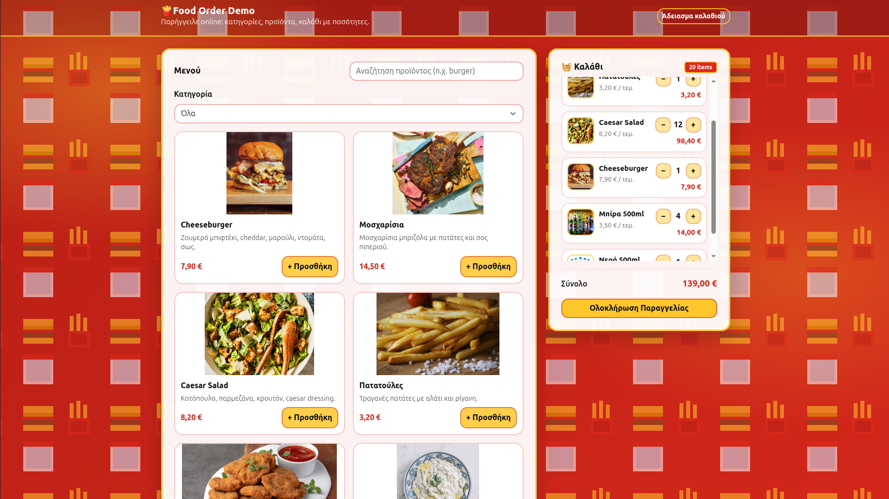

# 🍔 Food Order Form (Demo)

Μια διαδραστική φόρμα παραγγελίας (menu + cart + checkout modal) με **Vanilla JavaScript**, φτιαγμένη για εξάσκηση σε **DOM**, **events** και βασικό **state management**. ✅

---

## ✨ Features
- 🧾 Προβολή προϊόντων ανά κατηγορία
- 🔎 Αναζήτηση προϊόντων
- 🛒 Καλάθι με αύξηση/μείωση ποσότητας (+/−)
- 💾 Αποθήκευση καλαθιού με `localStorage` (μένει μετά από refresh)
- 💶 Υπολογισμός συνόλου + badge πλήθους ειδών
- ✅ Checkout modal με σύνοψη παραγγελίας


---
## 📸 Screenshots


---

## 🧠 AI βοήθεια κατά την υλοποίηση
Κατά την ανάπτυξη του project χρησιμοποιήθηκε **περιορισμένη βοήθεια από AI** για:
- 💡 ιδέες/προτάσεις βελτίωσης UI
- 🧠 μικρές κατευθύνσεις στη λογική (state/ροή)

Ο κώδικας στη συνέχεια **ελέγχθηκε, προσαρμόστηκε και τεκμηριώθηκε** ώστε να υπάρχει πλήρης κατανόηση της υλοποίησης και της ροής της εφαρμογής. 🧩
---

## 🧰 Tech Stack
- 🧱 HTML5
- 🎨 CSS3
- ⚙️ JavaScript (Vanilla)
- 🧩 Bootstrap

---

## 🚀 Run Locally
1. Κάνε clone το repo:
   ```bash
   git clone git@github.com:gkoutlis/food-order-form.git
